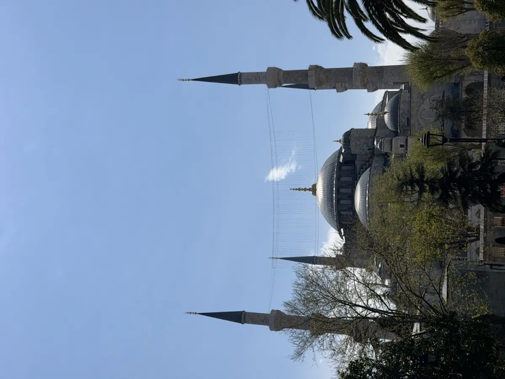
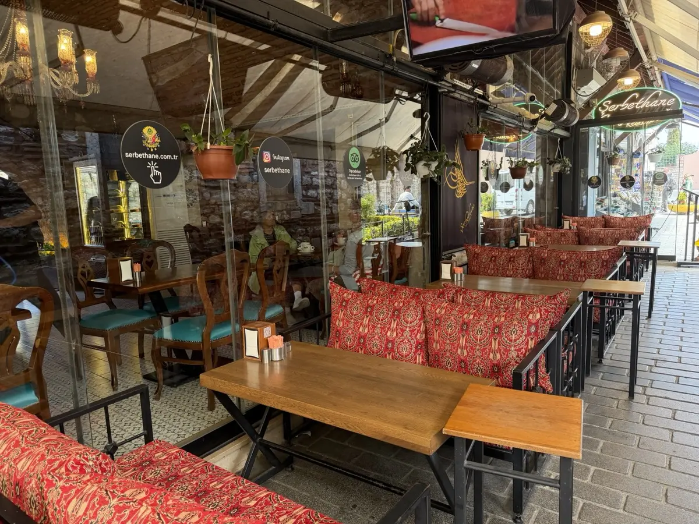
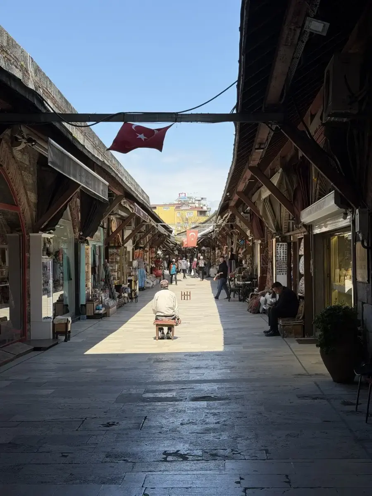

I gave Claude my dates, hotel, and "make it relaxed" — and got back a polished 3-day Istanbul itinerary with hourly slots, restaurant reservations, and ferry routes. Then I did maybe 40% of it.

That's not a complaint. The trip was great. But it taught me something specific about how AI travel planning actually works in the wild: the plan is scaffolding, not a script. Here's the unfiltered debrief — what I actually did, what I skipped, what cost what, and what I'd tell the next solo traveler heading to Istanbul.

## Quick Facts

- **Dates:** April 29 – May 2, 2026 (3 nights, solo)
- **Hotel:** Stayso The House Hotel, Sütlüce, Beyoğlu — quiet local neighborhood on the Golden Horn
- **Total spent (excl. flight + hotel):** ~196 EUR
- **Highlight:** Hagia Sophia — actual goosebumps
- **Plan deviation:** Roughly 60% — Topkapi, Pierre Loti, and the Asian side all skipped
- **Steps walked Day 2:** 30,000

## The Plan vs Reality

The AI plan was solid: Sultanahmet cluster on Day 1, Eyüp + Pierre Loti + Asian side on Day 2 (cleverly avoiding Taksim on May 1), bazaars and a quick lunch before flying out on Day 3.

What actually happened:

- **Day 1:** Hagia Sophia + Blue Mosque only. No Topkapi. No Karaköy Lokantası dinner. Just a long shisha break at a Sultanahmet café and a late dinner near the hotel.
- **Day 2:** Cold rain killed the Eyüp/Pierre Loti idea. Instead I bus-hopped along the European Bosphorus to Dolmabahçe Palace, Rumeli Hisarı, and Arnavutköy. Asian side never happened.
- **Day 3:** Skipped the bazaars. Just enjoyed the hotel breakfast and took public transport to the airport.

Three things consistently overrode the plan: weather, energy, and the gravitational pull of one specific café (more on that in a minute).

## Day 0 — Landing Late, M11 to the Rescue

Flight landed at 22:55. The AI plan recommended a taxi for ~25 EUR ("M11 metro is risky after delays"). In reality, M11 ran fine.

- Istanbulkart + M11 to Kağıthane: **6.61 EUR**
- BiTaksi from Kağıthane to hotel: **7.74 EUR**
- Total airport-to-hotel: **14.35 EUR** — about 40% cheaper than the AI's taxi recommendation

The lesson: AI plans hedge against unlikely worst-cases. Public transport often works fine in Istanbul, even late at night.

## Day 1 — Sultanahmet, Then Slowing Down Hard

Hotel breakfast first. Sütlüce is far from the historic center, so getting to Sultanahmet meant **bus 50E to Eminönü, then tram to Sultanahmet Camii** (the Blue Mosque stop). Smooth, cheap, easy.

### Hagia Sophia: The Trip's Best Hour

I bought the **combined Hagia Sophia + Hagia Sophia History and Experience Museum ticket for 50 EUR**. The museum opened recently and walks you through the building's 1,500-year history before you go in.

It's a lot of money for an attraction. It's also the thing I'd pay for again immediately.

The interior is overwhelming in a way no photo conveys. The dome shouldn't physically work. The marble panels are still cracked from the earthquake of 558. You can see Christian mosaics behind half-removed Islamic calligraphy, layered in plain view. Standing under it gave me actual goosebumps.

I budgeted an hour. I needed it.

### Blue Mosque, Free, Right Across the Square

The Sultan Ahmed Mosque (Blue Mosque) sits opposite Hagia Sophia. Free entry, modest dress, shoes off, women cover hair. Closed during prayer times — check the schedule before you arrive.

It's smaller in feel than Hagia Sophia despite being roughly the same age and scale. The Iznik tiles give the interior its name. Twenty minutes is enough.

### The Café That Hijacked the Trip

Between sights I wandered into [Şerbethane](https://www.serbethane.net/) — a traditional Turkish coffee/shisha spot near Sultanahmet. I ordered a melon-tobacco shisha, a pomegranate juice, a cafe latte, and a black tea.

**1,800 TRY (~34 EUR) with 10% tip.**

That's not cheap by Istanbul standards, but the place hooked me. Vaulted brick ceilings, low cushions, slow-moving locals, no tourist-trap vibes despite the location. I sat there for almost two hours.

I ended up coming back the next day.

### The Rest of Day 1

I walked across the **Galata Bridge** (a classic move — fishermen on top, restaurants below, the Bosphorus in front of you). Got a quick look at the **Arasta Bazaar** behind the Blue Mosque. Took a taxi back to Sütlüce (7.05 EUR via BiTaksi).

By 22:00 I was hungry again. Walked to **Maran Restaurant near the hotel** — a no-frills local spot. **1,000 TRY (~19 EUR)** for a full meal with drinks and tip.

What I skipped from the AI plan: Topkapi Palace, Basilica Cistern, sunset at Seven Hills Roof, Karaköy Lokantası dinner. All of them sound great. None of them got me as much as sitting at Şerbethane for two hours.

## Day 2 — May 1, Bosphorus Bus Hopping

May 1 in Turkey is Labor Day. Demonstrations were planned around Taksim Square; the AI plan correctly avoided that whole area. The plan was to do Eyüp Sultan Mosque + Pierre Loti café + the Asian side via ferry.

Then I woke up and it was rainy, cold, and windy. None of those plans survived contact with the weather.

### What I Did Instead

I took a bus and walked to **Dolmabahçe Sarayı** — the late-Ottoman palace on the Bosphorus. Passed **Beşiktaş Stadium** on the way (worth seeing if you care about football). Didn't go inside the palace — the queue and mood weren't right for a 3-hour palace tour.

From Dolmabahçe I caught a bus up the Bosphorus to **Rumeli Hisarı** — a 15th-century Ottoman fortress with dramatic walls right on the water. Walked around it, then continued north on foot to **Arnavutköy** — a small neighborhood with wooden Ottoman houses, narrow streets, fish restaurants.

Then I walked. A lot. Eventually back south to **Galata Tower**, then took the tram back to Sultanahmet for round 2 at Şerbethane.

This time: **mint shisha + pistachio coffee + black tea — 1,300 TRY (~24.68 EUR).**

### The Taxi Scam

From Eminönü tram station I grabbed a street taxi back to the hotel. **866 TRY (~16.44 EUR).** The driver — Ramazan — quoted me a flat rate and took a longer route than I expected. The same trip the day before was 7 EUR via BiTaksi.

I'm 90% sure I got slightly fleeced. Not enough to ruin the day, but enough to confirm the rule: **always use BiTaksi or Bolt in Istanbul.** Street taxis quote in cash and have wide latitude to "interpret" the route.

### 30,000 Steps, Late Dinner

By 21:00 I'd walked 30,000 steps (about 24 km). Not relaxed. Got dinner at **Haliç Et & Uykulu Restaurant** near the hotel — meat-focused Turkish spot. **1,220 TRY (~23.16 EUR).**

What I skipped from the AI plan: Eyüp Sultan, Pierre Loti café, the entire Asian side, Çiya Sofrası. All of them on my "next visit" list now.

## Day 3 — Easy Departure

Slept in. Took the Turkish hotel breakfast slowly — multiple cheeses, olives, honey, simit, scrambled eggs that were genuinely excellent.

- **11:45:** Checkout
- **Bus to Kağıthane → M11 metro to airport** (same combo as the arrival, in reverse)
- **~13:00:** At airport
- **~14:00:** At gate
- **16:55:** Flight

Skipped: Spice Bazaar, Süleymaniye Mosque, Hamdi Restaurant lunch. The AI plan had me tight on time. I had buffer instead. Worth it.

## Money Breakdown

| Category | EUR |
|----------|-----|
| Hagia Sophia + Museum ticket | 50 |
| Şerbethane (2 visits) | 59 |
| Restaurants (2 dinners) | ~42 |
| City taxis (incl. Ramazan) | ~31 |
| Buses, metro, tram | ~14 |
| **Total ex hotel/flight** | **~196** |

For 3 days solo, that's reasonable but not cheap. Hagia Sophia alone is 25% of the total, and Şerbethane visits ate another 30%. If you skip the shisha-café habit and the museum ticket, you could do this trip on under 100 EUR for everything except the hotel and flight.

## What Worked

- **M11 metro late at night.** Halved the airport transfer cost.
- **Sütlüce hotel location.** Quiet, local, cheap-by-bus to anywhere. The reflexive choice would have been Sultanahmet or Karaköy. Sütlüce gave me a calmer base camp.
- **One "comfort spot."** Şerbethane became a reset button between sights. Having a place that wasn't an attraction made the rest of the trip easier.
- **Dropping the plan when energy or weather called for it.** Day 2 turned into something better than the original plan would have produced.

## What Didn't Work

- **Day 2 weather.** Rain plus 30,000 steps is not "relaxed."
- **The Ramazan taxi.** Should have stayed disciplined with BiTaksi/Bolt every single ride.
- **Skipping Topkapi.** I'm conflicted on this one. Saving it for next visit is fine, but I missed seeing the Imperial Treasury and the Harem in person — a single ticket would have covered it.

## What I Skipped on Purpose

I deliberately didn't do:

- **Basilica Cistern** — atmospheric but not the best use of half a day
- **Bosphorus boat tour** — same magic on a normal public ferry between Karaköy and Kadıköy for 2 EUR
- **Topkapi Palace** — see above, half regret
- **Asian side / Kadıköy / Çiya Sofrası** — the most painful skip; weather killed it

Saving things for "next time" felt different than failing to make it. It gave the trip a frame — three days isn't enough for Istanbul, and pretending otherwise is how you ruin the days you actually have.

## What an AI-Planned Trip Actually Teaches You

The plan was good. Following 40% of it produced the right trip.

1. **AI plans are option lists, not schedules.** Treat the structure as suggestions and the timing as flexible.
2. **Day 1 anchors matter most.** Get the first day right (one big sight, one walking area, one meal) and the rest will self-organize.
3. **Always have a comfort spot.** Whatever Şerbethane was for me — find your version. It's where the "relaxed" actually happens.
4. **Weather kills 50% of plans.** Build the itinerary so a weather-day still has 2-3 options.
5. **Solo travel is forgiving.** No coordinating, no compromises. You can change everything at 11am with no consequences.

If you're new to AI travel planning, the [ChatGPT travel planning prompts guide](/chatgpt-travel-planning-prompts/) is the right starting point — it covers the prompts that actually produce useful output instead of generic listicles. For comparing tools, [Claude vs ChatGPT for travel planning](/claude-vs-chatgpt-travel-planning/) breaks down which one fits which kind of trip. And if you want to avoid the most common pitfalls before your first AI-planned trip, [AI travel planning mistakes](/ai-travel-planning-mistakes/) is the cheat sheet.

## Would I Do This Again?

Yes. I'd use AI planning the same way: get the structured option list, scout the city, then on the ground I'd ignore at least half of it.

Istanbul gave me what I asked it for: three days that didn't feel like work. I'm already thinking about the next visit — Topkapi, the Asian side, Pierre Loti café, and a Bosphorus ferry that costs 2 EUR. AI can plan that one too. I'll probably ignore most of it again.
